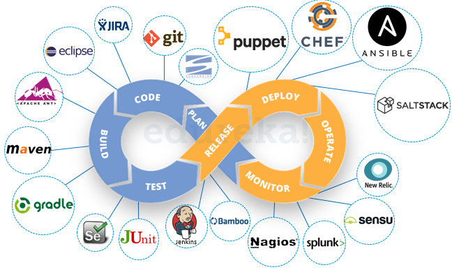
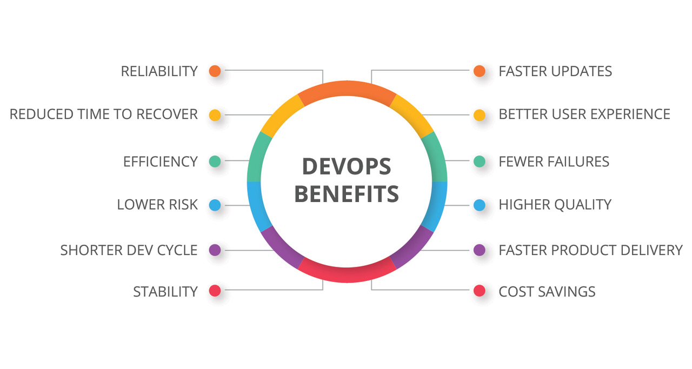
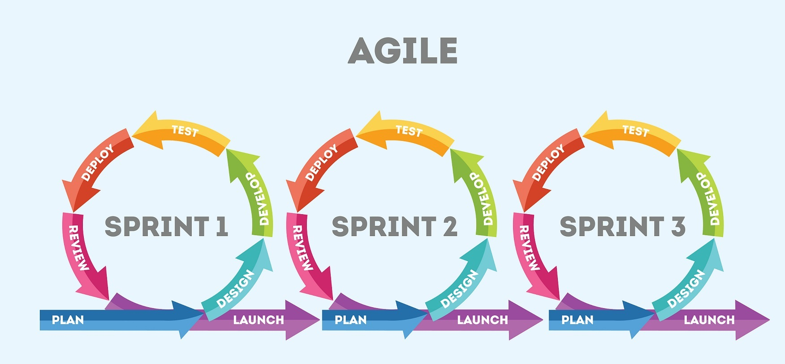
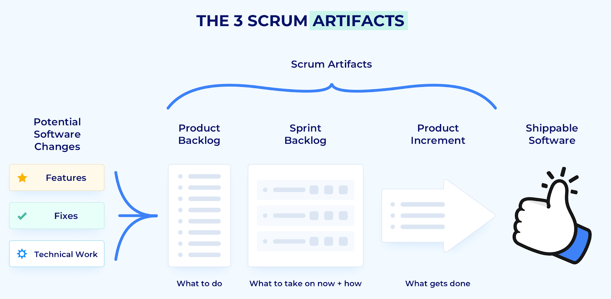
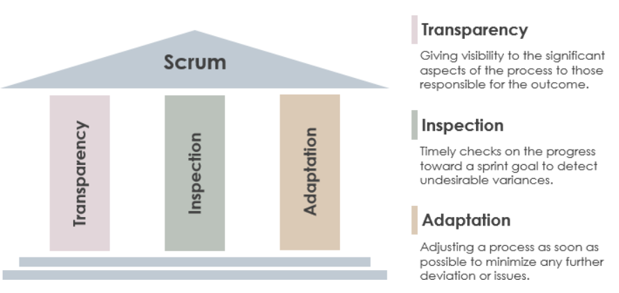

# DevOps Intro - Week #1

#### Summary of Week#1 Learnings
This week was classified as business week and we learned mostly soft skills. At the end of the week we installed python and pycharm on our machines.

## Elevator Pitch

We created an elevator pitch and we present it to our cohorts. An Elevator Pitch is defined as a short description of an idea, product, or company that explains the concept in a way such that any listener can understand it in a short period of time. It's a brief way of introducing ourselves and getting across key points. We need to have a good pitch for ourselves when we are interviewed by the client. Some Key points of a good Elevator Pitch:

- Between 30 Seconds to 2 Minutes, but ideally 60 - 90 Seconds.
- Highlight Achievements.
- Use Buzzwords.
- Be Confident, Use suitable tone and body language.
- Include your hobbies.

We received detailed constructive feedback about our pitch. 

## How to make a good presentation

We had to give presentation about devops in group. Our initial presentataion was not up to mark and we received feedback on how to improve it. Some key points include:

- Be confident and smile when presenting.
- Maintain eye contact and good body language.
- Less is more - Don't put in too many bullet points or texts.
- Use picture where possible instead of text, each slide should have atleast one.
- Don't read the script or sound like reading a script.
- Speak clearly and concisely.
- Keep the audience engaged.

## Interview Practice

We were allocated different groups and we had to interview each other and give feedback on how it went and how to improve on our interview skills further. It was very helpful as it gave us the chance to practice our skills and received feedback on how to improve it.

#### Sample Inteview Question

- Tell me about Yourself? (Should include your hobbies while answering it)
- Why Sparta Global?
- What are your aims after training?
- Where do you see yourself in 2 / 3 years?
- What are some key benefits of DevOps?
- Why do you want to become a DevOps Engineer?
- What do you think is your role as a DevOps Engineer?
- Why do you think you should be hired?
- Any question you'd like to ask?

#### Some key points for interview preparation.

- Create a good profile including the photograph.
- Create your Github Account & LinkedIn Profile.
- Elevator Pitch can be a good answer for Tell me about yourself.
- Research the company you are applying at.
- Research about the person interviewing you.
- Don't forget to ask questions at the end of interview.
- Always make sure you have answered what was asked, if in doubt confirm it with the interviewer. Examples:
  - Did that answer your question? or 
  - Do you want me to elaborate further?
  - [Tip:] Don't use them after every question.

## DevOps

### What is DevOps?

The term DevOps is a combination of two words, Development and Opreration. It is a set of practice and principles that allows a single team to manage the entire application development life cycle i.e. development, testing, deployment and monitoring. The devops culture is implemented in several phases with the help of several tools. It's main advantages are:

- Different teams can work together.
- Improve speed of delivery.
- It uses CI/CD Pipeline and automation to improve efficiency.
- It reduces time and helps reduce cost.

  

### Role of a DevOps Engineer.

The key role of DevOps Engineer includes:
- Bridge the communication gap between the development & operation teams.
- Collaborate across all teams to ensure smooth operation.
- Efficiently implement feedbacks from end users.
- Staying updated with relevant tools & technologies.

### How does DevOps benefit business?

## What is Agile?

Agile can be defined as a set of practice and principles that help teams deliver value to their customers faster and with higher quality.Some key advantages of Agile:

- Satisfied Customers by involving them in development process
- Improved Quality
- Adaptability
- Predictability
- Reduced Risk
- Better Communication

## What is Scrum?
Scrum is a lightweight framework that follows agile methodology. It helps multiple team to work together to deliver adaptive solutions for complex problems. It manages the projects by dividing it into multiple phases. It has
- quicker release of products
- higher productivity
- lower cost
- adaptive and flexible

### Roles in Scrum
**Product Owner**: 
- Product Owner is responsible for maximizing the value of the product and the work of the Team.
- Product Owner need to understand the clear vision of a product from the customer, end user or stakeholders point of view. 
- Product Owner is responsible for managing the product backlog and product backlog visibility. 
- Product Owner ensures the business value of the product.

**Scrum Master**: 
- Scrum Master makes the process run smoothly and facilitates the entire process.
- Scrum Master is responsible for the communication between the team to keep track of the projects.
- Scrum Master organizes and facilitates meetings and removes obstacles that impact productivity.

**Team**: 
- Development team are the people who build what is asked by the product owner.
- The team comprises of analysts, designers, developers, testers, etc. as appropriate and as relevant to the project.
- The Team size should be kept in the range from five to nine people, if possible.

The scrum team works together closely, on a daily basis, to ensure the smooth flow of information and the quick resolution of issues. The scrum team delivers product iteratively and incrementally, maximizing opportunities for feedback. Incremental deliveries of a complete product ensure a potentially useful version of working product is always available.

### Scrum Ceremonies

Scrum ceremonies are meetings that ensure that the scrum master, product owner and development team are in-sync. These ceremonies, or scrum events, are held at key instances in the agile sprint cycle. There are five scrum ceremonies:

1. **Sprint Planning**: This ceremony helps to set up the entire team for the coming sprint, creating a smooth pathway for a successful sprint. Sprint planning requires the participation of all the scrum roles: the development team, scrum master and the product owner.
2. **Daily Standup**: The daily scrum usually takes place each morning with the development team, scrum master and product owner. It is short in duration but makes sure that everyone knows what’s happening. It’s a way to ensure transparency across the team. 
3. **Sprint Review**: After the sprint has been completed, the team get together to demo or showcase their work. Each team member reviews the newly developed features during the sprint. This provides a space for the team to congratulate themselves on a successful sprint, which is important for morale. It also demonstrates the finished work for the entire team, so they can provide feedback and also get feedback from the stakeholders in the project.
4. **Sprint Retrospective**: The last scrum ceremony is called the sprint retrospective. It occurs at the end of a sprint, after the review. The retrospective includes the development team, scrum master and product owner. The retrospective is a way for the team to understand what has worked well and what didn’t come together over the previous sprint.
5. **Product Backlog Grooming**: Product backlog refinement, also known as product backlog grooming, is a meeting that takes place towards the completion of a sprint. The reason for the meeting is to review the backlog and keep it clean and orderly so that it’s ready for the next sprint.

### Scrum Artifacts

Scrum artifacts define the work that must be done. Scrum artifacts can be seen as source of vital information for the scrum team. They provide structure to the scrum process because they act as guidelines for the product development plan. There are three mostly used Scrum Artifacts:

1. **Product Backlog**: A product backlog is a list of everything that needs to be achieved on a project, broken down into individual items. It contains the baseline requirements of every feature needed for the end product and are prioritized by the product owner for the scrum team. It mainly consists of 3 different types of item:
 
    1. **User Stories**: A high-level descriptions of a feature, told from the perspective of the end-user of the product.
    2. **Bugs**: Problems that arised, that the product owner wants to be fixed.
    3. **Tasks**: Assigned to the scrum team to complete.
4. **Sprint Backlog**: The sprint backlog is the part of the product backlog that the team will be working on in their sprint. It is like a to-do list for the sprint. The sprint backlog is further broken down into tasks for the team to execute. Every item on the sprint backlog needs to get developed, tested and documented. The product owner helps the scrum team come up with a sprint backlog during their sprint meeting. It often contains: 
    1. **To-Do**: Tasks that have yet to start.
    2. **Doing**: Tasks where the work has begun.
    3. **Verify**: To Verify completed tasks that are waiting for verification by another scrum team member
    4. **Done**: No more work is required
5. **Product Increment**: This is the *most important* scrum artifact. The product increment is all the product backlog items that have been completed during a sprint, all integrated, tested and ready to be delivered or deployed.

### Three Pillars of Scrum

