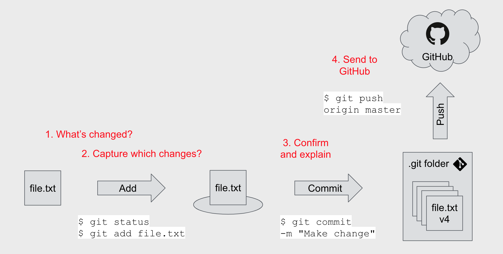

# Week 2 - Python and GitHub

## Day #1 - Python Basics

Python is a high-level, general-purpose programming language. It is very popular because of its easy syntax and not complicated for begineers to learn. It supports multiple programming paradigms, including structured, object-oriented and functional programming. It is often described as a "batteries included" language due to its comprehensive standard library.

## Variables

In **Python**, Variables are containers for storing data values. Python has no command for declaring a variable. A variable is created the when we first assign a value to it. Today we learned 4 different data types of variables:

1. **Integer**: Whole numbers
2. **Float**: Decimal point numbers.
3. **String**: Series of characters surrounded by either single quotation marks, or double quotation marks.
4. **Boolean**: Represent one of two values: True or False.

Some examples of variables:

```
num = 5              # num is an integer
height = 14.2        # height is float
first_name = "John"  # first_name is a string
is_resident = True   # is_resident is a boolean value
```
**Note**: Variable names are case sensitive.

## Comments

Python comments start with the # character and extend to the end of the line. We can start a comment from the start of the line, after some whitespaces or code.

- If we want to toggle a comment for multiple line we can use: **CTRL + /**

## Checking data types of variable

The **type()** method returns class type of the argument(object) passed as parameter.

```
print(type(num))          # Expected Output: <class 'int'>
print(type(height))       # Expected Output: <class 'float'>
print(type(first_name))   # Expected Output: <class 'str'> 
print(type(is_resident))  # Expected Output: <class 'bool'> 
```

### Python First Exercise

```
first_name = input("Enter your first name: ")
last_name = input("Enter your last name: ")
print("Your name is " + first_name + " " + last_name)

dob = input("Enter you Date of Birth: ")
course_name = input("Enrolled Course Name: ")
resident = input("Are you a UK resident: ")
print(dob)
print(course_name)
print(resident)

Expected Output: 

Enter your first name: Abhishek
Enter your last name: Jha
Your name is Abhishek Jha
Enter you Date of Birth: 01/02/2002
Enrolled Course Name: DevOps
Are you a UK resident: Yes
01/02/2002
DevOps
Yes
```
## Git & GitHub

**Git** is a free and open source software for distributed version control. It tracks changes in any set of files, and used in DevOps for coordinating work among the team. We can download git from [https://git-scm.com/](https://git-scm.com/downloads). When we download git, it downloads two additional components **Git Bash** and **Git GUI**.
- **Git Bash**: Git Bash is an application for Microsoft Windows environments which provides an emulation layer for a Git command line experience. It is similar to terminal for linux or powershell for windows.
- **Git GUI**: Git GUI is a graphical user interface for git that allows us to make changes to the repository by making new commits, amending existing ones, creating branches, performing local merges, and fetching/pushing to remote repositories.

**GitHub** is an online repository and hosting service for Software Development and Version Control using Git. It provides the distributed version control of Git plus access control, bug tracking, software feature requests, task management, continuous integration, and wikis for every project.

## Git Workflow

When we are done with our work or changes, in the Git VCS we have to follow the following steps:

- Check the status of our work, to identify if anything has been changed. `git status` command will show if there are any changes made.
- Add the changed files to the staging area.
``` 
git add <filename> [To add individual file to the staging area.]
git add . [To add all the file at once to the staging area.]
```
- Commit to the git folder. A message along with the commit is *highly recommended*.
```
git commit -m "Initial Commit"
```
- Once the commit is successfully done, we can push our code to the remote repository (GitHub in our case). We rename our branch to main to avoid any confusion.
```
git branch -M main
git push -u origin main
```
The -u flag creates a tracking reference for every branch that we successfully push onto the remote repository.



## Connecting Git to GitHub via SSH

To connect our project stored on the local host(local machine) via SSH, first we need to create a public and private key. The private key is for our use, and the public key will be uploaded in our github settings so we can connect to it securely. These are the steps we must follow to connect them.

1. Navigate to the SSH folder in our local machine. If the directory doesn't exist we get the error as shown below. We have to create one.


2. We can create the directory using `mkdir` command, and navigate to it using `cd` command. Ignore the `mkdir` command if the folder already exist.


3. Once we are inside that folder, we can generate the SSH key by using the following commands:

```
$ssh-keygen -t rsa -b 4096 -C "youremail@domain.com"
```
**Note**: This command is for **Windows** Machine only.

4. It will ask us to enter the *filename* and *passphrase*, press enter and leave these field blank.

```
Generating public/private rsa key pair.
Enter file in which to save the key (/c/Users/junus/.ssh/id_rsa):
Enter passphrase (empty for no passphrase):
Enter same passphrase again:
Your identification has been saved in /c/Users/junus/.ssh/id_rsa
Your public key has been saved in /c/Users/junus/.ssh/id_rsa.pub
The key fingerprint is:
SHA256:b+weJPVOFqec0cathTDMjivWy1BtP63B2bWj+cw4KMRnQ youremail@domain.com
The key's randomart image is:
+---[RSA 4096]----+
|         . ..o.  |
|        . o. +.  |
|       . o..* o  |
|        .o+EoB   |
|        S.o*B.   |
|         *=+o  . |
|        ..B+o.oo=|
|         = +o.oOo|
|        ..o  .o +|
+----[SHA256]-----+
```

5. If we see the response similar to above in our terminal, it means the key has been successfully generated. We can check them by using `ls` command. We should have 2 file(keys), a private key and a public key with the `.pub` extension.


6. We can now copy the public key to paste it into github. We access it using the `cat` command. The cat command is a utility command in Linux and is commonly used to print the content of a file onto the terminal. 

 

7. We now navigate to `settings`, in our github account by clicking our profile on the top right. Then from the left blade, we select `SSH and GPG keys` under `access` section.


8. Now we click on the new SSH key button and paste the earlier copied public key onto it. Make sure to give it a name, so that it can be easily identified later.

9. We have successfully connected our local machine (local git) to git hub using SSH.
